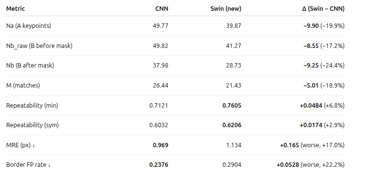

# SuperPoint + Transformer Backbone
Yoni Mandel and Yehuda Shani  
- Technion ECE - Deep Learning Project  
- Spring 2025  

# Introduction  
## Project Objective  
This project adapts and extends the MagicPoint [2] and SuperPoint [1] frameworks for keypoint detection. To enhance feature representation and improve robustness under challenging imaging conditions, we integrate a Transformer-based feature extraction backbone, specifically a Swin Transformer [7], into the detection pipeline. As inter-frame point correspondence will be established through optical flow tracking, and due to limited GPU compute resources, the descriptor computation is omitted. The proposed system is evaluated on the EuRoC dataset [4], a widely used benchmark for Visual Inertial Odometry, using established performance metrics, including repeatability and homography estimation accuracy.  

## Motivation  
Feature detection and matching are fundamental components of numerous computer vision tasks, including simultaneous localization and mapping (SLAM), 3D reconstruction, and image registration. While SuperPoint [1] has demonstrated strong performance across a variety of conditions, we hypothesize that replacing its convolutional backbone with a Swin Transformer [7] can further improve generalization and robustness, particularly in scenarios involving substantial appearance variations or geometric distortions.  

# Design  
## Structure  
**Encoder – CNN version**  
The original SuperPoint [1] encoder is a convolutional network that turns the input grayscale image into a smaller but more detailed feature map. It uses several convolution layers with ReLU activation and pooling, reducing the size by 8× while keeping important structures like corners and edges. This feature map is then used by the detector.  

**Encoder – Transformer version**  
In our new design, the CNN is replaced with a Swin Transformer [7] encoder. The image is split into small patches, each turned into an embedding vector with position information. These go through transformer layers that use self-attention to connect features from all over the image, not just nearby pixels. This allows the network to handle big viewpoint changes, distortions, and difficult lighting better than the CNN. The final output is reshaped into a feature map for the detector, just like before.  

**Detector head**  
The detector head takes the feature map from the encoder and predicts where keypoints are likely to be in the image. It uses a few small convolution layers to produce a heatmap. The original design is kept, where each cell of the heatmap has 65 values — one for each of the 8×8 positions inside the cell, plus one “no keypoint” option. A softmax is applied so the values become probabilities, then the map is reshaped and upsampled back to the original image size. The points with the highest probabilities are selected as the final keypoints.  

### CNN vs Swin Transformer Encoder

## Data  
The experimental pipeline utilizes the following datasets:  

- **Synthetic Shapes** [3] — employed for pretraining the keypoint detector, providing a controlled environment for learning fundamental geometric structures.  
- **EuRoC MAV Dataset** [4] — used for evaluating detection performance under realistic conditions relevant to visual-inertial odometry.  
- **COCO** [5] or other large-scale image datasets — optionally used for fine-tuning to improve generalization to diverse scenes.  

**Data Preprocessing** – all images undergo the following preprocessing steps prior to model training or evaluation:  
- Resizing and normalization — to standardize image dimensions and pixel intensity ranges across datasets.  
- Homographic warping — applied as a data augmentation technique to simulate viewpoint changes and geometric transformations, enhancing robustness to real-world variations.  

## Metrics for Evaluation  
1. **Repeatability** – Measures how consistently the same keypoints are detected in different views of the same scene.  
2. **Localization Error** – Average pixel distance between the projected ground-truth keypoint position and the detected keypoint position.  
3. **Homography Estimation Accuracy / Correctness** – Measures how accurately the detected keypoints can be used to estimate the geometric transformation between image pairs.

# Results  
## Inference on a few Examples
  

## Metrics Comparison  
Setup (same for both models): 120×160, det_thresh=0.02, nms=4, topk=50, px_thresh=3.0, valid_margin=4, seed=123.
Dataset: EuRoC mav0/cam0

Table summary

Repeatability (min/sym): 
Swin: 0.7605 / 0.6206
CNN: 0.7121 / 0.6032
Swin’s detections are more consistently re-found after a homography, despite fewer points overall.

Geometric accuracy & borders: CNN is better 

Mean reprojection error: CNN 0.969 px vs Swin 1.134 px

Border FP rate: CNN 0.2376 vs Swin 0.2904

Counts & matches: CNN higher (partly because it finds more points)

Matches M: CNN 26.44 vs Swin 21.43

Detections (Nb): CNN 37.98 vs Swin 28.73
Swin detects fewer points at  our thresholds; with fewer candidates, total matches are lower even though repeatability is higher.

# Conclusion  
On our modest dataset:
- Swin (Transformer) is more repeatable under homography: it re-detects the same points more often after warping.
- CNN is sharper and cleaner: lower geometric error and fewer border artifacts, and it produces more matches at our current settings (partly because it detects more points).
- Swin finds fewer points but keeps them more consistent across homographies → better repeatability
- CNN localizes a bit more precisely (lower MRE) and behaves better near borders (lower border FP rate).

# Future work  
1. Match detection density
- Compare at the same number of points
2. Light threshold sweep for Swin
- Lower Swin’s --det_thresh a bit 
3. Sharpen Swin’s peaks
- Use your HA fine-tune checkpoint
- Add a simple subpixel quadratic peak refinement
  
# How to run  
We provide a thoroughly documented Jupyter Notebook, SuperPoint_detector_CNN_Vs_Transformer.ipynb, that guides users through the installation process and demonstrates how to train the model from scratch as well as run all components of the project. This format offers a more accessible alternative to following the installation instructions directly from GitHub and enables even students without access to GPU resources to run and explore the project with ease.

# Ethical statement  
## Stakeholders:  
- Computer vision researchers and developers working on SLAM, AR/VR, and robotics.  
- Companies deploying vision-based systems in navigation, mapping, or object tracking.  
- The general public whose images or environments may be processed by such systems.  

## Implications:  
Teams can optimize performance and race strategies, though over-reliance may limit human adaptability. Broadcasters and commentators can enhance analysis, enriching the fan experience with deeper insights.  

## Ethical Considerations:  
There must be clear boundaries on acceptable use. As the amount of surveillance grows exponentially, models that can extract data from such systems could pose significant privacy risks.  

## References  

[1] DeTone, D., Malisiewicz, T., & Rabinovich, A. (2018). SuperPoint: Self-Supervised Interest Point Detection and Description. *Proceedings of the IEEE Conference on Computer Vision and Pattern Recognition Workshops (CVPRW)*. [PDF](https://arxiv.org/pdf/1712.07629)  

[2] DeTone, D., Malisiewicz, T., & Rabinovich, A. (2017). MagicPoint: An Interest Point Detector Trained on Synthetic Images. *arXiv preprint*. [PDF](https://arxiv.org/pdf/1712.07629)  

[3] Synthetic Shapes Dataset. [GitHub Repository](https://github.com/magicleap/SuperPointPretrainedNetwork)  

[4] Burri, M., Nikolic, J., Gohl, P., Schneider, T., Rehder, J., Omari, S., Achtelik, M., & Siegwart, R. (2016). The EuRoC Micro Aerial Vehicle Datasets. *International Journal of Robotics Research (IJRR)*. [PDF](https://projects.asl.ethz.ch/datasets/doku.php?id=kmavvisualinertialdatasets)  

[5] Lin, T.-Y., Maire, M., Belongie, S., Hays, J., Perona, P., Ramanan, D., Dollár, P., & Zitnick, C. L. (2014). Microsoft COCO: Common Objects in Context. *European Conference on Computer Vision (ECCV)*. [PDF](https://arxiv.org/pdf/1405.0312)  

[6] Shaofeng Zeng. SuperPoint-Pytorch (np_version branch). [GitHub Repository](https://github.com/shaofengzeng/SuperPoint-Pytorch/tree/np_version)  

[7] Liu, Z., Lin, Y., Cao, Y., Hu, H., Wei, Y., Zhang, Z., Lin, S., & Guo, B. (2021). Swin Transformer: Hierarchical Vision Transformer using Shifted Windows,”
in ICCV, 2021.

[8] J. Sun, Z. Shen, Y. Wang, H. Bao, and X. Zhou, “LoFTR: Detector-Free Local Feature
Matching with Transformers,” in CVPR, 2021.

[9] A. Dosovitskiy et al., “An Image is Worth 16x16 Words: Transformers for Image Recognition
at Scale,” 2020 (ViT).
